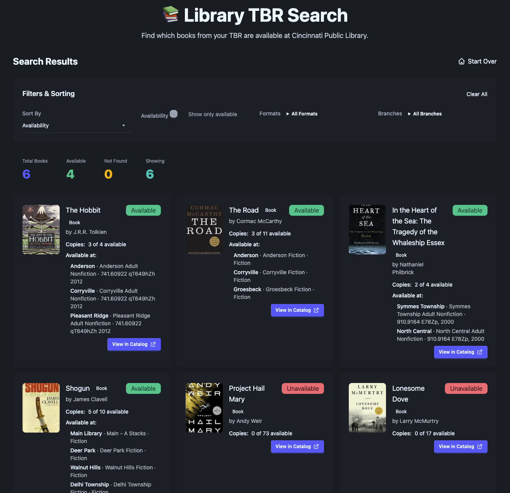

# Library TBR Search

A SvelteKit web app that helps you find which books from your Storygraph TBR (To Be Read) list are available at the Cincinnati & Hamilton County Public Library.



## Features

- 📤 **File Upload**: Drag & drop or browse to upload your Storygraph CSV export
- 🔍 **Library Search**: Automatically searches the Cincinnati Public Library catalog for each book
- 📊 **Availability Info**: Shows which books are available and where
- 🏢 **Branch Locations**: Displays specific branch locations with call numbers
- 🔗 **Direct Links**: Links to each book in the library catalog
- 🎛️ **Filtering**: Filter by branch, availability, and sort results
- 💅 **Beautiful UI**: Built with Tailwind CSS and DaisyUI

## Tech Stack

- **SvelteKit** - Full-stack framework
- **TypeScript** - Type safety
- **Tailwind CSS + DaisyUI** - Styling
- **papaparse** - CSV parsing
- **zod** - Runtime validation
- **BiblioCommons API** - Library catalog search

## Getting Started

### Prerequisites

- Node.js 18+ and npm

### Installation

```bash
# Install dependencies
npm install

# Start dev server
npm run dev

# Build for production
npm run build

# Preview production build
npm run preview
```

The dev server will start at `http://localhost:5173`

## Usage

1. **Export your TBR list from Storygraph**:
   - Go to your Storygraph library
   - Click "Export" and download the CSV file

2. **Upload to the app**:
   - Drag and drop the CSV file or click "Choose File"
   - The app will parse the CSV and extract books with "to-read" status

3. **Search the library**:
   - Click "Search Library" to start searching
   - The app will search for each book and check availability
   - This may take a few minutes due to rate limiting (1 second between requests)

4. **Browse results**:
   - View which books are available
   - Filter by branch location
   - Sort by availability, title, or author
   - Click "View in Catalog" to see the book in the library catalog

## How It Works

### Backend

The backend consists of three main components:

1. **BiblioCommons API Client** (`src/lib/server/bibliocommons.ts`)
   - Searches the Cincinnati Public Library catalog
   - Checks availability and branch locations
   - Uses the BiblioCommons Gateway API (no authentication required)

2. **CSV Parser** (`src/lib/server/csv-parser.ts`)
   - Parses Storygraph CSV exports
   - Validates data using Zod schemas
   - Filters for "to-read" books only

3. **Rate Limiter** (`src/lib/server/rate-limiter.ts`)
   - Ensures 1 second delay between API requests
   - Prevents overwhelming the library API

### API Endpoints

- **POST /api/upload**: Accepts CSV file, returns parsed book list
- **POST /api/search**: Takes book list, searches library catalog, returns availability

### Frontend

Built with Svelte 5 using the new `$state` and `$derived` runes. Components include:

- **FileUpload**: Drag & drop file upload
- **SearchProgress**: Progress indicator during search
- **FilterPanel**: Branch, availability, and sort filters
- **ResultsTable**: Grid display of search results
- **BookCard**: Individual book result with availability info

State management uses Svelte stores with derived stores for filtering and sorting.

## Deployment

This app is configured for Node.js deployment using `@sveltejs/adapter-node`, making it suitable for Railway, Render, or any Node.js hosting platform.

### Railway Deployment

1. Push code to GitHub
2. Connect repository to Railway
3. Railway will auto-detect the Node.js app and deploy

Environment variables: None required (the BiblioCommons API doesn't need authentication)

## Limitations

- Currently only supports Cincinnati & Hamilton County Public Library
- Rate limited to 1 request per second (searches take ~2 minutes for 100 books)
- BiblioCommons API is undocumented and could change

## Future Enhancements

- Support for multiple library systems
- Goodreads CSV import
- Export results to CSV
- Save search history
- Email notifications when books become available
- Book cover images
- More advanced search options (ISBN-first matching)

## License

MIT

## Acknowledgments

- Cincinnati & Hamilton County Public Library for their excellent catalog system
- BiblioCommons for their (undocumented but functional) API
- Storygraph for CSV export functionality
